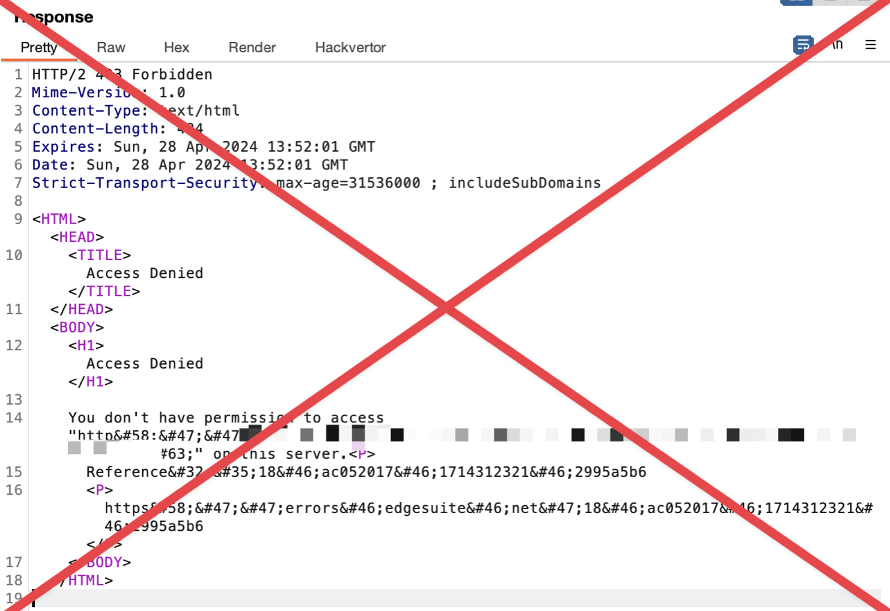

# nowafpls

# Table of Contents

- [nowafpls](#nowafpls)
  - [Documented WAF limitations](#documented-waf-limitations)
  - [Installing nowafpls](#installing-nowafpls)
  - [Using nowafpls](#using-nowafpls)  
  - [Authors](#authors)
  - [License](#license)

# nowafpls

Most web application firewalls (WAFs) have limitations for how much data they can process when a request body is sent. This means for HTTP requests that contain a request body (i.e. POST, PUT, PATCH etc), it is usually possible to bypass the WAF by simply prepending junk data. 

When the request is padded with this junk data, the WAF will process up to X kb of the request and analyze it, but everything after the limits of the WAF will pass straight through.

nowafpls is a simple Burp plugin which will contextually insert this junk data into your HTTP request inside the repeater tab. You can select from a preset amount of junk data you want inserted, or you can insert an arbitrary amount of junk data by selecting the "Custom" option.

This tool is just 80 or so lines of Python, it's incredibly simple but works for most WAFs lol.

## Documented WAF Limitations

| WAF Provider          | Maximum Request Body Inspection Size Limit             |
|-----------------------|--------------------------------------------------------|
| Cloudflare            | 128 KB for ruleset engine, up to 500 MB for enterprise |
| AWS WAF               | 8 KB - 64 KB (configurable depending on service)       |
| Akamai                | 8 KB - 128 KB                                          |
| Azure WAF             | 128 KB                                                 |
| Fortiweb by Fortinet  | 100 MB                                                 |
| Barracuda WAF         | 64 KB                                                  |
| Sucuri                | 10 MB                                                  |
| Radware AppWall       | up to 1 GB for cloud WAF                               |
| F5 BIG-IP WAAP        | 20 MB (configurable)                                   |
| Palo Alto             | 10 MB                                                  |
| Cloud Armor by Google | 8 KB (can be increased to 128 KB)                      |

## Installing nowafpls

nowafpls is a Jython based Burp Plugin.

1. Clone or download this repo.
2. Go to the extensions tab in Burp Suite.
3. Click "Add"
4. Select Extension Type - Python
5. Select "nowafpls.py" that you downloaded in Step 1

## Using nowafpls

https://github.com/assetnote/nowafpls/assets/5241936/dad77c3a-d550-4e5d-894d-027256137148

1. Send any request to the repeater tab that you'd like to bypass WAF for.
2. Put your cursor in a place you would like to insert junk data.
3. Right click -> Extensions -> nowafpls
4. Select how much junk data you want to insert
5. Click "OK"

nowafpls will insert junk data as per the type of request (URLEncoded/XML/JSON) automatically.

## Authors

* **Shubham Shah** - *Initial work* - [github](https://github.com/infosec-au)

## License

MIT
